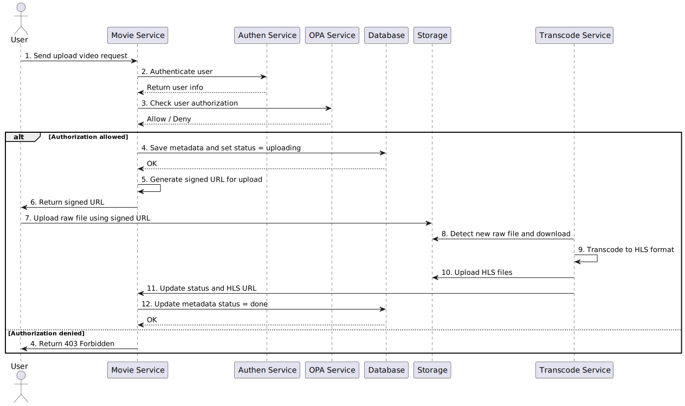
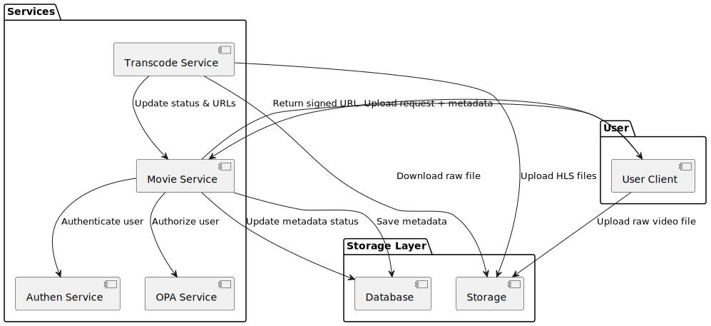

# CineVerse – Microservices-based Movie Streaming Backend Platform

# Movie Streaming Platform (Backend)

A microservices-based backend system for a movie streaming platform, built with **Java (Spring Boot)** and **Golang**.  
It supports movie management, authentication, video transcoding, and streaming, with monitoring and centralized logging.

---

## Tech Stack

- **Movie Service** (Java, Spring Boot + MongoDB) – movie CRUD, genres, actors, and streaming handler.
- **Auth Service** (Golang) – JWT authentication & role management.
- **Transcode Service** (Golang + ffmpeg) – converts uploaded videos into HLS (`.m3u8` + segments).
- **Traefik** – API Gateway & reverse proxy.
- **RabbitMQ** – message queue for async communication (upload → transcode).
- **MinIO** – object storage for video files and HLS assets.
- **PostgreSQL** – authentication database.

---

## Basic Project Structure

```
├── authen-service/ # Authentication service (Go + Gin + Keycloak integration)
├── frontend/ # Simple demo frontend for playback
├── keycloak/ # Keycloak configs (realm, clients, users)
├── minio/ # MinIO storage & configs
├── movie-service/ # Movie CRUD + streaming logic (Java + MongoDB + PostgreSQL)
├── opa/ # OPA policies and configs
├── postgres/ # PostgreSQL + Flyway migrations
├── rabbitmq/ # RabbitMQ config
├── traefik/ # API Gateway configuration
├── transcode-service/ # Video transcoding (Go + ffmpeg + MinIO)
├── docker-compose.yml # Root Docker Compose
└── README.md
```

---

## Architecture Overview

- **Authentication Flow**  
  

- **Movie Streaming Flow**  
  

---

## RabbitMQ Setup

This project uses RabbitMQ for asynchronous communication between services.  
Definitions (exchanges, queues, bindings) are managed via **`definitions.json`**.

The `definitions.json` file is **not committed** to the repository.  
To set it up manually:

```
1. Open **RabbitMQ Management UI** at [http://localhost:15672](http://localhost:15672).
2. Login with the default credentials (`guest/guest`, unless overridden).
3. Go to **Admin → Import Definitions**.
4. Upload your local `definitions.json`.
```

---

## How to Run

1. Clone the repository:

   ```bash
   git clone https://github.com/your-username/movie-streaming-platform.git
   cd movie-streaming-platform
   ```

2. Start the services:

```bash
docker-compose up -d
```

Access components:

- RabbitMQ: http://localhost:15672

- Keycloak: http://localhost:8081

- MinIO Console: http://localhost:9001

- Frontend demo: http://localhost:3000

## Planned Improvements

- Add user profile service for watch history & personalization.

- Implement rating/review system for movies.

- Improve transcoding pipeline (adaptive bitrate, more formats).

- Enhance security with Keycloak or OAuth2 provider.

- Deploy to Kubernetes for scalability.
